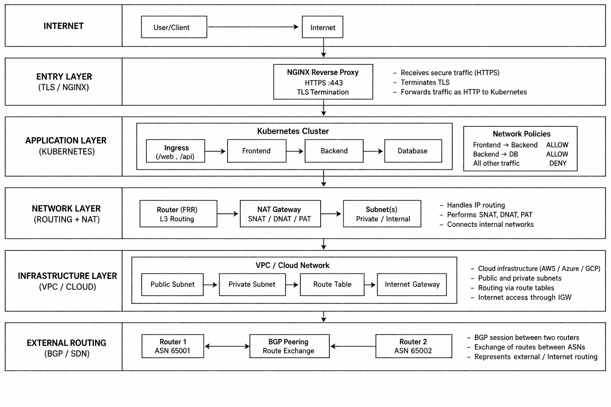

# Networking Labs Portfolio

Hands-on networking lab portfolio focused on **routing, subnetting, NAT, firewall rules, TLS, cloud networking, Kubernetes networking, SDN/BGP fundamentals, and troubleshooting**.

This repository was created to strengthen practical networking knowledge for DevOps, Cloud Engineering, Infrastructure, and Kubernetes-related roles.

The goal is to show how different networking concepts connect across traditional infrastructure, cloud environments, and containerized platforms.

---

## What This Project Demonstrates

This repository demonstrates practical and theoretical understanding of:

- IP addressing and subnetting
- VLSM design
- Static routing
- NAT: SNAT, DNAT, and PAT
- Firewall rules with iptables
- IPv6 and dual-stack concepts
- Cloud networking fundamentals
- Kubernetes networking concepts
- Services, Ingress, and Network Policies
- TLS and HTTPS basics
- Reverse proxy concepts
- SDN fundamentals
- BGP fundamentals with FRRouting
- Network troubleshooting tools and workflows

---

## Global Diagram



This diagram summarizes the general networking concepts explored across the labs.

---

## Repository Structure

```text
networking-labs/
├── 01-ip-subnetting-routing-basics/
├── 02-nat-firewall-and-diagnostics/
├── 03-ipv6-and-dual-stack/
├── 04-cloud-networking/
├── 05-kubernetes-networking/
├── 06-security-and-tls/
├── 07-sdn-and-bgp/
├── docs/
│   └── global-diagram.png
└── README.md
```

Each lab includes documentation, configurations, diagrams, or practical examples related to a specific networking area.

---

## Lab Breakdown

## Lab 01 — IP, Subnetting and Routing

Focus:

- IPv4 addressing
- Subnetting
- VLSM exercises
- Static routing
- Multi-router communication
- Basic traffic flow validation

Tools and concepts:

- `ping`
- `traceroute`
- ARP
- routing tables
- FRRouting concepts

---

## Lab 02 — NAT, Firewall and Diagnostics

Focus:

- SNAT
- DNAT
- PAT
- iptables firewall rules
- traffic filtering
- packet flow troubleshooting

Tools and concepts:

- `iptables`
- `nmap`
- `tcpdump`
- `curl`
- `netstat`
- connection testing

---

## Lab 03 — IPv6 and Dual Stack

Focus:

- IPv6 addressing
- IPv4 and IPv6 coexistence
- dual-stack networking
- SLAAC concepts
- Router Advertisements
- Neighbor Discovery Protocol

This lab documents IPv6 fundamentals and how IPv6 differs from traditional IPv4 workflows.

---

## Lab 04 — Cloud Networking

Focus:

- Cloud network design
- AWS, Azure, and GCP networking concepts
- public and private subnets
- route tables
- gateways
- load balancing
- VPC peering concepts

This lab connects traditional networking knowledge with cloud infrastructure design.

---

## Lab 05 — Kubernetes Networking

Focus:

- Kubernetes networking model
- CNI fundamentals
- Pod-to-pod communication
- Services
- ClusterIP
- NodePort
- Ingress routing
- Network Policies

This lab demonstrates how Kubernetes abstracts and manages service-to-service communication.

---

## Lab 06 — Security and TLS

Focus:

- Nginx reverse proxy
- HTTPS
- self-signed certificates
- TLS termination
- basic TLS validation
- secure entry point concepts

Tools and concepts:

- Nginx
- OpenSSL
- HTTPS testing
- reverse proxy architecture

---

## Lab 07 — SDN and BGP

Focus:

- traditional networking vs SDN
- control plane vs data plane
- OpenFlow fundamentals
- BGP concepts
- ASN
- route exchange
- FRRouting simulation ideas

This lab introduces higher-level networking concepts useful for understanding modern infrastructure and cloud networking design.

---

## Key Skills Demonstrated

| Area | Skills |
|---|---|
| Routing | Static routing, routing tables, traffic path analysis |
| Addressing | IPv4, IPv6, subnetting, VLSM |
| NAT | SNAT, DNAT, PAT concepts |
| Firewalling | iptables rules, filtering, access control |
| Cloud Networking | VPC design, subnets, gateways, route tables |
| Kubernetes Networking | Services, Ingress, CNI, Network Policies |
| Security | TLS, HTTPS, reverse proxy, secure entry points |
| Troubleshooting | tcpdump, nmap, curl, traceroute, ping |
| Advanced Concepts | SDN, BGP, FRR, control plane/data plane |

---

## Tools and Technologies

- Docker
- Linux networking tools
- FRRouting
- Nginx
- iptables
- tcpdump
- nmap
- curl
- traceroute
- Kubernetes
- Kind / Minikube concepts
- OpenSSL

---

## Environment Constraints

This project was developed under constrained conditions, including limited or unstable internet access.

Because of that, some labs prioritize:

- local simulation
- offline-friendly documentation
- pre-downloaded images
- conceptual diagrams
- command-based validation
- reproducible learning workflows

These constraints helped reinforce how to design and troubleshoot systems without relying only on managed cloud services.

---

## Evidence

Current visual evidence is available in:

```text
docs/
```

| Evidence | File |
|---|---|
| Global networking diagram | [docs/global-diagram.png](docs/global-diagram.png) |

This repository is mainly a lab portfolio and documentation hub. More command-output evidence can be added over time to strengthen validation.

---

## Recommended Evidence to Add Later

To make this repository stronger for recruiters, future evidence could include:

```bash
ip route
```

```bash
iptables -S
```

```bash
docker network ls
```

```bash
docker ps
```

```bash
kubectl get svc
```

```bash
kubectl get pods -o wide
```

```bash
curl -v <service-url>
```

```bash
tcpdump -i <interface>
```

Suggested evidence files:

```text
docs/evidence/ip-routes.txt
docs/evidence/iptables-rules.txt
docs/evidence/docker-networks.txt
docs/evidence/kubernetes-services.txt
docs/evidence/curl-connectivity-test.txt
docs/evidence/tcpdump-sample.txt
```

---

## Purpose

This repository was created to build a stronger foundation in networking for DevOps and Cloud Engineering.

Networking is essential for understanding:

- how applications communicate
- how cloud infrastructure is designed
- how Kubernetes services expose workloads
- how firewalls and NAT affect traffic
- how TLS protects communication
- how routing decisions affect availability
- how to troubleshoot connectivity issues

---

## Current Limitations

This repository is a networking lab portfolio, not a production network implementation.

Current limitations:

- Some cloud networking sections are conceptual
- Some labs are documented simulations rather than full cloud deployments
- Limited command-output evidence is currently included
- No automated validation scripts yet
- No packet capture evidence yet
- No full CI/CD validation for configurations

These limitations are intentional for the current scope of the project.

---

## Future Improvements

Potential improvements:

- Add command-output evidence for each lab
- Add packet capture examples with tcpdump
- Add more diagrams for each networking layer
- Add Docker Compose network simulations
- Add Kubernetes NetworkPolicy validation with Calico or Cilium
- Add AWS VPC implementation examples
- Add automated validation scripts
- Add troubleshooting runbooks
- Add before/after connectivity test evidence

---

## Lessons Learned

This project helped reinforce several networking concepts:

- Routing controls where traffic goes.
- NAT changes how traffic is seen across network boundaries.
- Firewalls must match the real traffic path.
- Kubernetes networking simplifies service discovery but adds abstraction.
- TLS termination is an important part of secure service exposure.
- Cloud networking builds on traditional networking fundamentals.
- Troubleshooting requires checking each layer separately.
- Diagrams make infrastructure easier to reason about.

---

## Why This Project Matters

This project supports DevOps and Cloud Engineering foundations by connecting traditional networking with modern infrastructure.

```text
Subnetting
   ↓
Routing
   ↓
NAT
   ↓
Firewalling
   ↓
TLS
   ↓
Cloud Networking
   ↓
Kubernetes Networking
   ↓
Troubleshooting
```

A strong understanding of networking makes it easier to debug infrastructure, deploy applications, secure services, and understand cloud-native platforms.

---

## Final Notes

This repository is part of my DevOps, Cloud, Networking, and Infrastructure learning portfolio.

It documents hands-on networking practice across traditional, cloud, and Kubernetes environments, with a focus on practical understanding, troubleshooting, and infrastructure reasoning.
